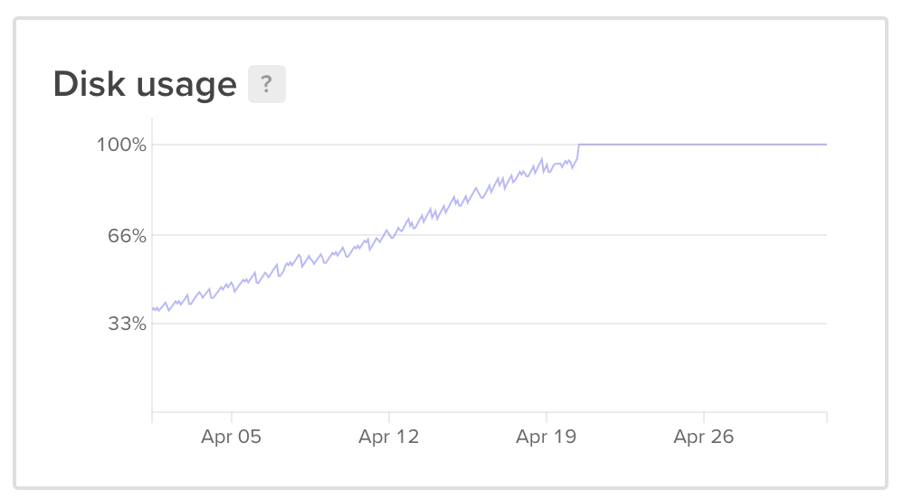
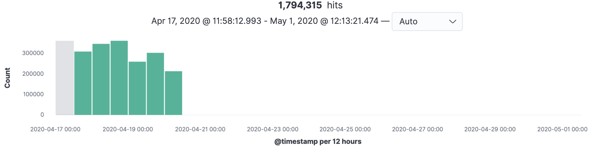
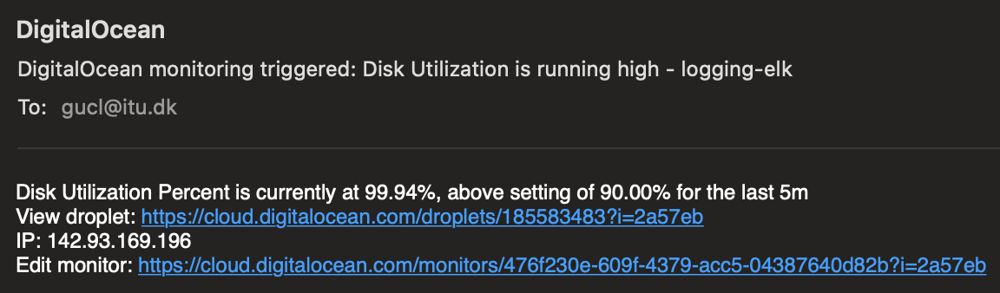
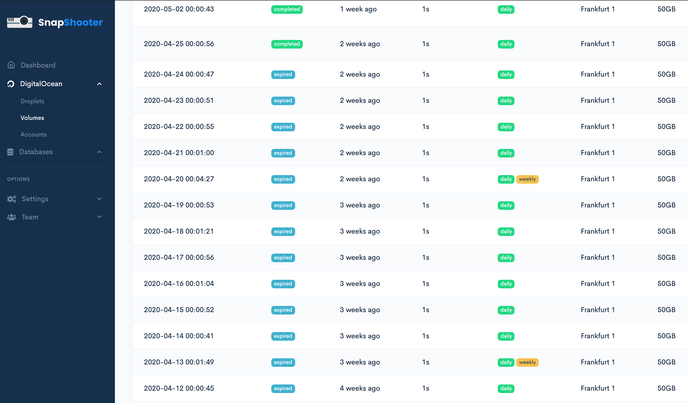

## Need for Better Monitoring and Alerting for Entire Production Setup

Throughout the course, we have experienced various operational issues in the production environment, which has revealed flaws in our monitoring setup. In this section, we will go in-depth with the most prominent issues and explain how they have contributed to the major lessons learned within operations and especially monitoring.

### Missing Visualization of Disk Capacity Metrics for Production VM

As mentioned in the *Monitoring* section of the *System Perspective* chapter, we monitored the capacity of the Block Storage volume that is attached to the Production VM and used to store data for the database. While this metric was found essential to visualize, in the sense that we could observe if the disk was about to reach full capacity and thus proactively dealing with the issue, we left out visualizing the disk capacity of the primary disk device. The metric was, however, collected with Prometheus.

At one point, the primary disk device reached full capacity, which caused a downtime of the entire application running on the Production VM as a deployment failed to complete due to insufficient disk space. Specifically, there was not enough disk space to store the latest Docker images on the machine, which occurred while the Docker Compose tool was replacing the containers running the application.
After manually deleting the old, unused Docker images on the machine, we were able to run the application on the machine again.

The lesson learned in this situation is that it is crucial to monitor and observe the capacity of all disk devices for a single machine, e.g. through visualizations on a monitoring dashboard. It is essential to be proactive in these situations to avoid reaching the same situation where the system comes to a halt unexpectedly.

### Missing Monitoring of Logging Server

As mentioned, our white-box infrastructure setup only collected metrics from the Production VM. We did not set up Prometheus to also collect metrics from the logging server, which had remarkable consequences.

At one point, the primary disk device reached full capacity due to great amount of stored logs in Elasticsearch, which caused the entire logging subsystem to come to a halt due to insufficient disk space. The logging subsystem was unable to collect and process any logs that were sent to it. A screenshot of the disk usage on the machine, found on DigitalOcean monitoring dashboard, is shown in Figure 37.

  
**Figure 37:** Graph of utilized disk space on logging server. Screenshot taken from DigitalOcean monitoring dashboard.

As we did not monitor or visualize any metrics of the server, this issue went entirely unnoticed for at least ten days until the simulation stopped and we began to write this report. A screenshot of our Kibana dashboard, as shown in Figure 38, shows how no logs were collected and processed between April 20th to April 30th 2020, where the simulation stopped.

  
**Figure 38:** Graph of gathered logs in logging subsystem from April 17th to April 30th. Screenshot taken from Kibana dashboard.

As we could not free up disk usage on the machine due to insufficient disk space to even write OS-related temporary folder to perform deleting operations, we decided to scale the instance vertically for more disk space.

The lesson learned in this situation is that it is crucial to monitor critical components of the system to avoid downtime. In retrospect, it would also be beneficial to configure cleanup policies in Elasticsearch, e.g., deleting logs older than 30 days, to avoid filling the disk.

### Missing Alert Setup

Another flaw with our monitoring solution was that the metrics for the infrastructure was only used to visualize them in a meaningful way on a dashboard. While this setup was great to give a historical and up-to-date operational status of the system, we never used the metrics to automatically create alerts to be more proactive and discover operational problems earlier than they occurred. We only occasionally (twice a week as the highest) checked up on the dashboard.
While we used *Synthetics* for blackbox monitoring of the system, as described in the *System Perspective* chapter, the alerts were generated *after* the system experienced operational issues - and only in regards to our simulator API.

One solution would have been to use DigitalOcean's alerting solution or Grafana's built-in alerting plugin, called *AlertManager*, to generate alerts when specific metrics surpass a certain limit. One case would have been to generate an alert whenever the capacity of a primary disk device on a machine reached 90 percent. A screenshot of such an alert for the logging server, generated by DigitalOcean, is shown in Figure 39. This alerting was set up after the simulator stopped to test this functionality.

  
**Figure 39:** Disk usage alert for logging server generated by DigitalOcean.

Furthermore, we did not set up any alert for our logs either. It would have been beneficial to be notified whenever an internal server error occurred, or the system received a large amount of traffic within a short time range for detection of DDOS attacks.

## Need for Disaster Recovery Training

On April 17th, we accidentally broke our production database setup while manually resetting the Docker containers on the Production VM after having failed to extract data of the database using [`pg_dump`](https://www.postgresql.org/docs/9.3/app-pgdump.html). More specifically, the data in the database container was mounted to a file path on the Block Storage volume with a [bind mount](https://docs.docker.com/storage/bind-mounts/) to persist the data. Our mistake was that we used a bind mount instead of using a single [Docker volume](https://docs.docker.com/storage/volumes/) for the database container. After having reset the database container, the new container that was created could not load the persisted data from the previous container located on the Block Storage volume. This issue is due to the Docker Compose tool creating a different mount setup whenever the tool starts the container setup from scratch.

At this time, we were unaware of the technical explanation for the given issue and thought that we had wiped all data during the reset. [A true horror story that real companies have experienced as well](https://techcrunch.com/2017/02/01/gitlab-suffers-major-backup-failure-after-data-deletion-incident/). We tried to restore a snapshot backup of our Block Storage volume that we had setup [*SnapShooter*](https://snapshooter.io/) to generate every 24 hours. However, we encountered an error during this operation: The restored Block Storage volume was completely void of data and checking the dashboard of SnapShooter revealed that the backup operations took only one second, as shown in Figure 40, which indicates some kind of error.

  
**Figure 40:** Dashboard of SnapShooter. This dashboard lists all performed backup operations of the Block Storage volume.

We never succeeded in mounting the persisted data in a new database container, and we decided not to change the setup due to time constraints.

We could have prevented this situation from occurring in our production environment resulting in remarkable consequences, if we had done some disaster recovery training for this given scenario of losing production data to test our backup procedure. The training could be to restore the entire production system with existing production data, using a backup, in a different environment to reveal any issues with the backup, the Docker Compose setup, or the configuration of machines. The necessity of regularly training disaster recovery is an important lesson learned from an operational perspective.

## Continuous Integration in terms of Maintenance and Refactoring

Throughout the course, the CI pipeline and the multiple automated tests that run in it have been essential for our maintenance and refactoring tasks, as they ensured that our application would still conform to the specification, whenever code changes were introduced. In particular, larger and more risky code changes, like in this [pull request](https://github.com/DevOps-Drengene/DevOps-Project/pull/93) where a greater refactor in which the Repository Pattern was implemented, the automated tests gave us confidence that the refactor would not introduce breaking changes.

Moreover, the overall stability of the system has been excellent over the course. No code changes deployed from the pipeline resulted in downtime or broken functionality from the simulator perspective. However, we did introduce some changes that unintentionally introduced a bug in the front-end application. More specifically, some key data in the UI was not shown whenever a user navigated to the profile view as described in [this issue](https://github.com/DevOps-Drengene/DevOps-Project/issues/133). This bug was randomly discovered while navigating the front-end application in the production environment.

As the automated tests in the pipeline might reveal, our prime focus throughout the course was to conform to the simulator. Therefore several unit and integration tests were written to cover all functionality expected by the simulator. This led us intentionally to focus less on the front-end application.

The point is that the bug that we accidentally introduced could have been caught in the CI pipeline when the changes were introduced. We already wrote quite thorough [end-to-end/UI tests](https://github.com/DevOps-Drengene/DevOps-Project/blob/master/tests/e2e/e2e.test.js), but we had difficulties in integrating these in the pipeline due to issues with running them in a Docker container.

The lesson learned in this situation is that we must have automated tests covering the entire application to more confidently introduce changes – especially doing refactoring. Furthermore, by not having these tests running in the pipeline, it is hard to spot which changes that resulted in this bug.

## Our DevOps Style of Work

In order to reflect upon our DevOps style of work, it would seem appropriate to start with a definition of what the 'DevOps' term means. As discussed in class, no standard definition exists for the 'DevOps' term. A possible definition comes from Jabarri et al. (2016), who conducted a Systematic Mapping Study on the definition where they propose the following:

> DevOps is a development methodology aimed at bridging the gap between Development (Dev) and Operations (Ops), emphasizing communication and collaboration, continuous integration, quality assurance and delivery with automated deployment utilizing a set of development practices.

The DevOps Handbook by Kim et al. (2016) extends a bit on this definition, saying DevOps has three perspectives or 'Ways': The First Way concerns having a fast flow from development to operations. The Second Way is about enabling fast and constant feedback from Operations to Development, and finally The Third Way concerns enabling a culture of continual experimentation and learning.

In the process of working on MiniTwit, we have experienced significant differences in how we were working in this course compared to other project-oriented courses at ITU, such as 'Analysis, Design and Software Architecture'. The typical approach to these projects has been a risky big-bang-style of projects where individual software components are developed by the same students and integrated (often shortly) before hand-in. In most of these projects, the focus is mainly on development while the IT-operation is always an afterthought or nonexistent. This is a contrast to how most resources in the IT industry are spent on operations and not development and a stark contrast to the approach suggested by this course.

In our work on MiniTwit, we have employed a set of practices, tools and attitudes that can be related to the Three Ways that Kim et al. proposes DevOps is all about.

We have been shown how to design and apply a Continuous Deployment pipeline that allowed us to introduce small changes into production frequently. This is the antithesis to the big-bang project style where considerable changes are merged together, always being uncertain about whether something would break. By pushing smaller changes frequently, we could be more certain about whether something breaks and where the fault is. The Continuous Deployment pipeline worked in extension of our Continuous Integration pipeline verifying our small code changes and provided us with fast feedback growing the software more 'organically'. Together our CI/CD exemplifies how we followed the First Way of DevOps: having a fast flow from development to operations.

We followed the Second Way of DevOps by implementing and observing our monitoring and logging systems, allowing us to gain an insight into our running production system and its status. For example, we discovered that one of our API endpoints was abnormally slow to respond, which we addressed quickly as described in the *Monitoring* section in the *System Perspective* chapter. That discovery could not have been made without the logging and monitoring of our system. If we had been better at observing the monitoring systems, we could also have prevented the growing disk usage of our logging system (as described previously). This is a contrast to our other projects where the running system could be seen as a black box.

The Third Way concerns, among other things, a learning culture. Compared to other courses and projects, we have been introduced to a significant amount of new tools to learn, discover and experiment with. If a task included the usage of some tool that a group member had experience with, we very often decided that another group member should give the task a try with the experienced group member as support. Furthermore, in our group, we have tried to have everybody take ownership of the whole system. This is counter to previous projects where students often worked on separate parts of the system. In this regard, we followed The Third Way by trying to foster learning and experimentation in the group.

In this course, we have made the first real foray into the DevOps style of work, and we have certainly made mistakes along the way. [But at least we were the group with the most processed requests by the simulator](http://142.93.104.18/status.html).
