# Process Perspective

In this section, we will explain how we, as a team, have been organized and collaborated throughout the course. We will go in detail with how we have used GitHub as a centralized hub:

- To organize work,
- For version control of application source code, configuration files (for tools like Docker Compose, Prometheus, and Grafana), and infrastructure declaration and configuration in multiple repositories,
- To continuously deploy changes into the production environment.

GitHub enables great collaboration and project management for several reasons:

- The repositories act as a single source of truth for all application source code and configuration files of the system running in production and provide great awareness for all members about suggested changes. They act as shared repositories that all team member contribute their work to, which streamlines the workflow.
- [Issues](https://help.github.com/en/github/managing-your-work-on-github/about-issues) and [pull requests](https://help.github.com/en/github/collaborating-with-issues-and-pull-requests/about-pull-requests) are linked on one platform to connect suggested code changes in a pull request to the issue that specifies the task to be done.
- The repositories, which also includes a wiki, are a great place to store relevant document alongside code, e.g., how to set up and run the system on our local machines.

At the beginning of the course, we created a GitHub [organization](https://github.com/devops-drengene) to contain all our repositories and an unified [project board](https://help.github.com/en/github/managing-your-work-on-github/about-project-boards) to keep track of the issues.

## Organization of Repositories on GitHub

### Initial Multi-Repository Setup

We initially went with a setup consisting of three repositories. A repository was created for each of the `Frontend` and `Webserver` subsystems to separate the two subsystems from each other completely. The repositories contained the application source code and a `Dockerfile` used to create a Docker image of the subsystem. The intent was to let the subsystems be managed by their own version control setup to control releases independently.

The third repository, titled *[DevOps-Project](https://github.com/DevOps-Drengene/DevOps-Project)*, served as a parent repository with the two other repositories as submodules. The purpose of this repository was to:

- reference the submodules on their latest stable release,
- control the primary releases of the entire application,
- contain tests for the full application (e.g., integration and end-to-end tests),
- contain common documentation,
- contain configuration files for tools used to build and run the complete containerized application (i.e., `docker-compose` files),
- contain a `Vagrantfile` used to provision and configure the Production VM.

A screenshot of the root folder in this parent repository is shown in Figure 25.

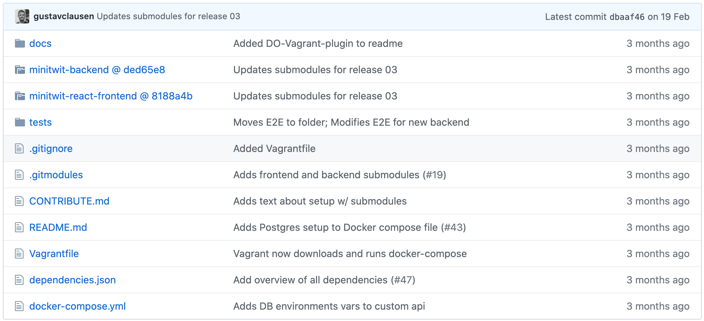  
**Figure 25:** Screenshot of the root folder in the former parent repository with submodules, tests, and various configuration files. Source: [https://github.com/DevOps-Drengene/DevOps-Project/tree/session-03](https://github.com/DevOps-Drengene/DevOps-Project/tree/session-03)

### Current Mono-Repository Setup

The multi-repository setup did, however, get too complicated to maintain, as the submodule pointers of the parent repository had to be updated repeatedly to point to the newest commits of the submodules whenever we released a new version of the entire application. The frequent changes we made to the application at that time involved changes to both subsystems at the same time, so this structure introduced an unnecessary complexity overhead.

Given this situation, we decided to transform the submodules into folders of the parent repository, such that there was only *one* mono-repository containing the entire application. Following this structure made it easier to have the whole application versioned as one large unit.

As illustrated in the screenshot in Figure 26, the subsystem folders (*backend*, which is the `Webserver` subsystem, in this case), are structured as separate projects. That is, they contain all files used to build and package the subsystem.

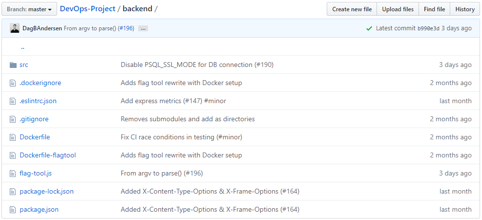  
**Figure 26:** Root folder of _backend_ subsystem folder in main repository. Source: [https://github.com/DevOps-Drengene/DevOps-Project/tree/master/backend](https://github.com/DevOps-Drengene/DevOps-Project/tree/master/backend)

As time progressed, we also added all configuration files for the monitoring subsystem and log shipping tool, Filebeat, to the repository. Thus, this mono-repository contains: 

- all the application source code,
- tests,
- and configuration files for running the entire system, including the application, monitoring, and file shipping solution, on a local machine, in the CI/CD pipeline, as well as on the Production VM.

A screenshot of the root folder in this mono-repository is shown in Figure 27.

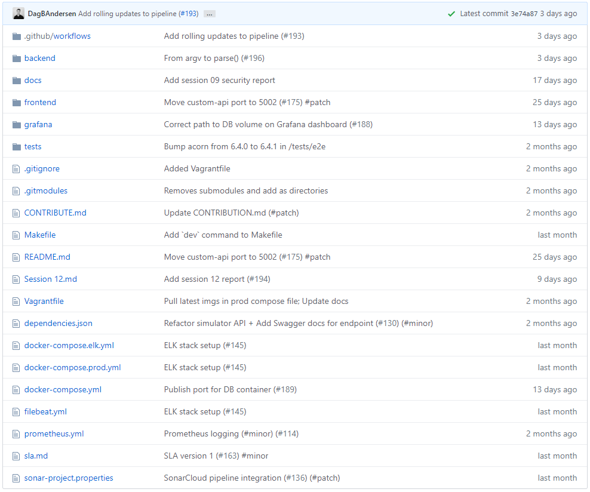  
**Figure 27:** Screenshot of the root folder in the main repository. Source: [https://github.com/DevOps-Drengene/DevOps-Project](https://github.com/DevOps-Drengene/DevOps-Project)

### Additional Repositories

In addition to the main repository, we have two other repositories: *[docker-elk](https://github.com/DevOps-Drengene/docker-elk)* and *[itu-minitwit-docker-swarm-terraform](https://github.com/DevOps-Drengene/itu-minitwit-docker-swarm-terraform)*.

The *docker-elk* repository is a fork from [https://github.com/deviantony/docker-elk](https://github.com/deviantony/docker-elk). The repository contains all the configuration files needed to build and run the logging subsystem, which is the Elastic stack (ELK), using Docker and Docker Compose.

A screenshot of the root folder in this repository is shown in Figure 28.

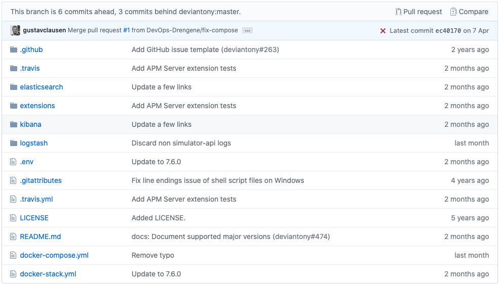  
**Figure 28:** Screenshot of the root folder in the *docker-elk* repository. Source: [https://github.com/DevOps-Drengene/docker-elk](https://github.com/DevOps-Drengene/docker-elk)

The *itu-minitwit-docker-swarm-terraform* repository is a fork from [https://github.com/itu-devops/itu-minitwit-docker-swarm-teraform](https://github.com/itu-devops/itu-minitwit-docker-swarm-teraform). The repository contains all infrastructure declaration files and scripts used by Terraform to provision and configure the underlying host machines (nodes) of the entire Docker Swarm setup.

A screenshot of the root folder in this repository is shown in Figure 29.

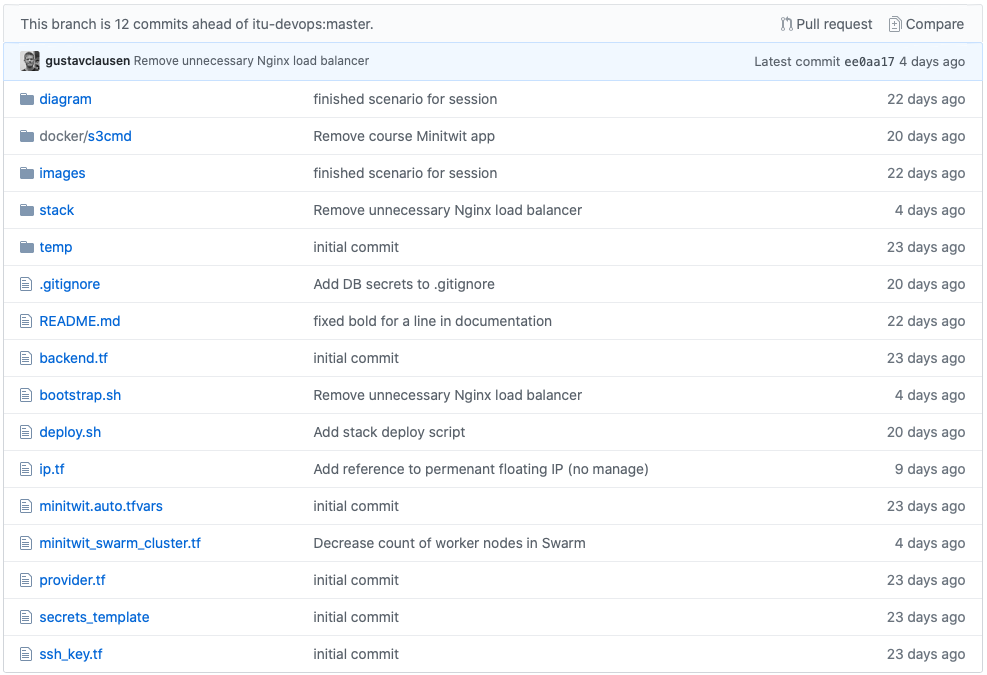  
**Figure 29:** Screenshot of the root folder in the *itu-minitwit-docker-swarm-terraform* repository. Source: [https://github.com/DevOps-Drengene/itu-minitwit-docker-swarm-terraform](https://github.com/DevOps-Drengene/itu-minitwit-docker-swarm-terraform)

The content of these additional repositories could easily have been a folder in the main repository as with the application subsystems. However, we decided to keep them as separate repositories for a clear separation of concern from the main repository. Also, changes to these repositories were done entirely separately, whereby versioning and deployment could be handled independently of the main repository.

## Development Process and Team Organization

### Organization

The team has been organized in a very flat hierarchy, much resembling a Scrum Development Team in the sense that all members of the team are equal with no leader. No one has had specific domains assigned – we have strived to let everyone try a little bit of everything.

### Task Management

Issues and a corresponding project board were used extensively. The project board is essentially a Kanban board containing all the issues with assignees and their current state (i.e., open, in progress, in review, and done) from all of our repositories. A screenshot of the project board can be seen in Figure 30.

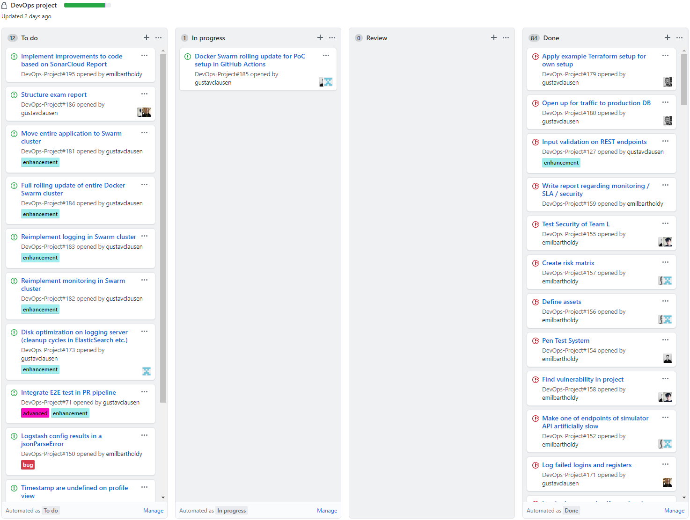  
**Figure 30**: Unified project board in our GitHub organization.

### Communication and Planning

The communication tool *Slack* has been the team's primary mean of day-to-day communication throughout the course. Furthermore, due to the Coronavirus lockdown, we have had weekly video meetings on *Google Hangouts*, usually directly following the Thursday lectures, with all group members assembled. The video meetings have been used to jointly plan and organize the given week's tasks by splitting the tasks into issues on GitHub and assigning responsible persons. Furthermore, the meetings have been used to discuss issues that have popped up during the past week, e.g. alerts or observations from our monitoring setup. The meetings have lasted from ½ to 1½ hours depending on how extensive the week's tasks were, and how much coordination work was needed to be done in terms of which order certain tasks should be completed in.

The issues corresponding to the weekly tasks of [session 8](https://github.com/itu-devops/2020-spring/blob/master/sessions/session_08/Session%2008.ipynb), where the topic was service-level agreements, logging, and log analysis, is shown in Figure 31.

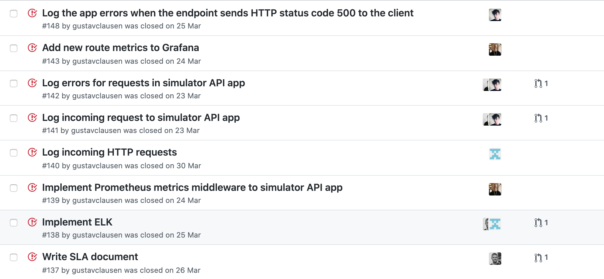  
**Figure 31:** Example of organizing weekly tasks as well as maintenance and evolution work in issues on GitHub.

The created issues for the given week also included maintenance and evolution tasks, such as issue [#139](https://github.com/DevOps-Drengene/DevOps-Project/issues/139) and [#143](https://github.com/DevOps-Drengene/DevOps-Project/issues/143), that we found important to solve as well.

### Applied Branching Strategy

For our branching strategy, we chose to go with *Scaled Trunk-Based Development* as introduced on [https://trunkbaseddevelopment.com/](https://trunkbaseddevelopment.com/). In this way of working, all developers share a single trunk branch, `master` in our case, and then we have many, short-lived (ideally only up to a few days) feature branches, usually with a single developer per feature branch. When the developer is happy with his work, he creates a pull request to the trunk. For the pull request to be accepted and merged, several tests/checks have to pass to validate the integration of the suggested code changes with the existing code base, and another developer has to approve the request. This type of development enjoys easy merging but at the expense of the time required to perform code reviews. We experienced that this strategy negatively affected the time to integrate suggested changes into the shared trunk, however we think that the overall code quality has benefited from this approach.

The trunk branch is protected, as code on this branch is directly deployed to the production environment and therefore has to be thoroughly tested and code reviewed. As such, pushing directly to the trunk branch is not possible, which enforces the use of feature branches that have to be approved to be merged.

### Development Workflow

The development workflow of our group, illustrated with a sequence diagram, is shown in Figure 32.

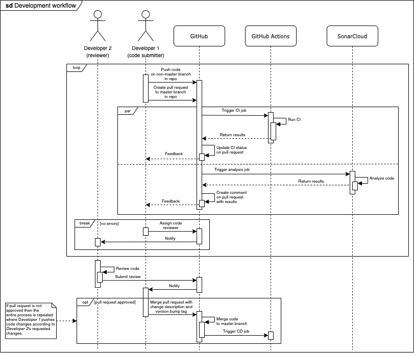  
**Figure 32:** UML sequence diagram of development workflow

When new work (such as a feature or bug fix as described in a GitHub issue) is to be undertaken, the developer:

- branches out of the `master` branch,
- commits the work on a separate branch,
- and then requests a merge back into `master` with a pull request as described in the last section.

Code conflicts are resolved on the branch to be merged, i.e., if there is a conflict, `master` is merged into the feature branch, on which the conflicts are resolved. The merge can then commence.

The code on the base branch of the pull request is run through the Continuous Integration (CI) stage of the pipeline on GitHub Actions and analyzed by SonarCloud. The different steps in the CI stage of the pipeline on GitHub Actions are explained in greater detail in the next section, *CI/CD Pipeline*.

SonarCloud is used to perform static code analysis on all branches and pull requests. The tool can detect bugs, security vulnerabilities, code smells, and code duplication, which is reported on every pull request as shown in Figure 33.

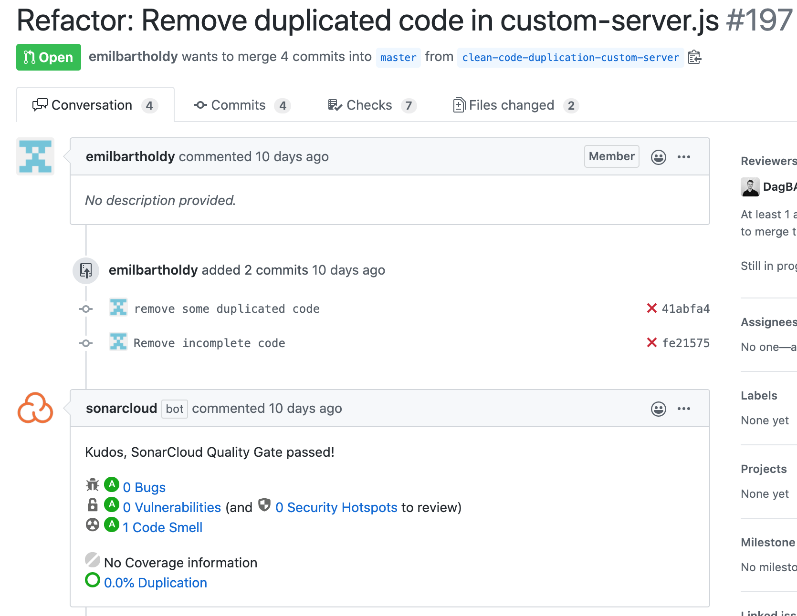  
**Figure 33:** SonarCloud analysis results on pull request. Here one new code smell is detected.

In order for all checks to pass on pull requests, the code has to pass the SonarCloud Quality Gate. We have used the [default Quality Gate settings](https://sonarcloud.io/organizations/devops-drengene/quality_gates/show/9), which ensure that:

- Test coverage is above 80%.
NB: We never got to set up the CI pipeline to generate unit test reports such that SonarCloud could read the results.
- The percentage of duplicated lines is less than 3%.
- Maintainability is rated `A`.
- Reliability is rated `A`.
- Security is rated `A`.

When all checks have passed on a pull request, an approval by another developer is requested. This developer performs a code review and writes requested changes if necessary. When the pull request is approved, the code changes get merged into the `master` branch with a single, squashed commit. In the commit message's title, we annotate a *version tag* that specifies which part of the project's current version semantic number that will be incremented, that is either the major, minor, or patch part, when the changes are released as a GitHub release in the automated Continuous Deployment (CD) stage of the pipeline.

In our [contribution guide document](https://github.com/DevOps-Drengene/DevOps-Project/blob/master/CONTRIBUTE.md#integrating-contributions), we have specified a guideline for when to use which version tags depending on what changes introduced. In the body of the commit message, we write what high-level changes were introduced in the pull request. This text becomes the notes for the GitHub release. After the merge into the `master` branch, the CD stage is triggered on GitHub Actions, which will be explained in greater detail in the next section.

## CI/CD Pipelines

This section gives an overview of the different stages in the CI/CD pipeline to describe how code changes are integrated into the existing code base and how they are automatically deployed into the running production environment.

We have only configured a CI/CD pipeline for our main repository due to time constraints. Thus, code changes in the additional repositories are manually deployed to the production environment.

We have used GitHub Actions to create our CI/CD pipeline. In the pipeline, we use *actions*, which are individual tasks in the pipeline, which will be elaborate on in this section. Using GitHub Actions seemed like the obvious choice, as we were already deeply committed to GitHub, with which it is fully integrated. That and the super easy setup made it a good choice for a small project like MiniTwit.

Our single CI/CD pipeline is divided into two stages - the Continuous Integration (CI) stage and the Continuous Deployment (CD) stage.
[The complete configuration of the pipeline can be found in our main repository](https://github.com/DevOps-Drengene/DevOps-Project/blob/master/.github/workflows/ci-cd.yml).

### Continuous Integration

This section covers the CI stage of the pipeline, which is run on every pull request and on pushes to `master`. This stage contains building and testing the code, which is done to ensure that the new code does not break any existing functionality. It ensures the *integration* of new and existing code.

An activity diagram illustrating all activities/steps in the CI stage of the pipeline is shown in Figure 34.

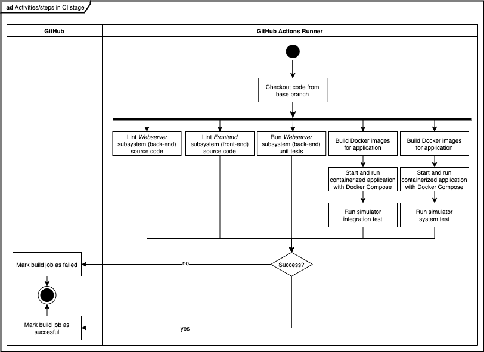  
**Figure 34:** UML activity diagram illustrating all activities/steps in CI stage of pipeline.

The stage contains five steps that run simultaneously:

1. The source code for the `Webserver` subsystem is analyzed by the `eslint` static code analysis tool. This tool enforces code style consistency and checks the code based on a number of rules, e.g. that each statement must be terminated by a semicolon. Leaving out the semicolon is not necessarily bad - we just want to enforce it in our codebase. The check fails if there are any so-called *linting errors*. This step just requires `node`.
2. The source code for the `Frontend` subsystem is analyzed by `eslint` as well. The check fails if there are any linting errors. This step just requires `node`.
3. The unit tests for the `Webserver` subsystem are run with `jest`. The check fails if any of the unit tests fail. This step just requires `node`.
4. The containerized application is built and run with Docker Compose and a number of black-box integration tests are run. These integration tests check that the simulator API behaves according to the specification. The tests can be found in [this file](https://github.com/DevOps-Drengene/DevOps-Project/blob/master/tests/simulator-integration-test/minitwit_sim_api_test.py).
5. The containerized application is again built and run with Docker Compose and a mock simulator, which resembles the real simulator, is run against the API, which puts a load on the system. This ensures that the application is able to respond to requests in the manner that the simulator sends them.

We did not practice Continuous Delivery in the sense that we deployed the application in a separate staging or development environment to test the production readiness of the changes to the application.

By utilizing containerization, we were confident that if it would pass the automated tests in the pipeline, it would work in production. Having containers, the application behaves the same on our machines, in the CI pipeline during automated tests, and on the Production VM.

### Continuous Deployment

This section covers the CD stage of the pipeline, which is triggered only on pushes to `master`. That is, both the CI and CD stages are run on pushes to `master`, while pull requests only run the CI stage. One could argue that it is not necessary to run the tests again when merging to `master` because the tests already ran when opening the pull request. This is true, but the test run may be outdated, because `master` may have been updated in the meantime before merging. This may introduce bugs and errors, which we prevent by testing again on `master` before deploying. Should a bug manage to get pushed to `master`, it will not go into production, since the tests should catch it. That is nevertheless the goal.

The CD stage covers deploying the code to the production environment, which explains why it is only run on `master`. The stage is named `build-deploy` in the GitHub Actions configuration file.

An interaction overview diagram illustrating the entire deployment and release process, as executed in the CD stage in the pipeline, is shown in Figure 35.

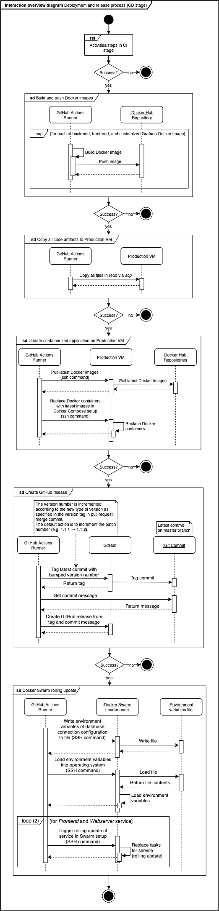  
**Figure 35:** UML interaction overview diagram illustrating deployment and release process (CD stage)

In the CD stage, Docker images for `frontend`, `backend` (`Webserver` subsystem), and `grafana` components are built and pushed to Docker Hub. Then all source code in the repo, which includes configuration files for the different components like Prometheus, are copied with `scp` to the Production VM. Then, on the Production VM, the containers are updated and spun up with the Docker Compose tool. Afterward, the version number is incremented, and a new release on GitHub is created. Finally, an update is rolled out on the Docker Swarm to update the running services with the newest Docker images as well. It follows the rolling update technique, which the scheduler of the Docker Swarm setup performs as specified in step 4 in [this tutorial](https://docs.docker.com/engine/swarm/swarm-tutorial/rolling-update/). If a step fails in the process then the remaining steps are skipped. We did not implement any automatic roll-back of steps that were executed successfully, which could have been beneficial to ensure atomicity of deployments.

## Security Assessment

A detailed description of our security assessment can be found [here](https://github.com/DevOps-Drengene/DevOps-Project/blob/master/docs/group_k_session_09_security_report.pdf). A brief overview can, however, be found in this section.

### Assets

- The Production VM Running Services
- User Data
- Various Credentials For Systems
- Logging Data
- Source code
- Employees

### Risks

Risks can have an impact on the service we provide, if it is realised. An impact can be categorised according to the CIA triad: Confidentiality, Integrity, and Availability. *Confidentiality* concerns having data only be available for suitable actors. *Integrity* involves maintaining the consistency, accuracy, and trustworthiness of data over its life cycle. Finally, *Availability* concerns the availability of our services and data.

Each risk below has an impact which has been categorized according to the CIA triad.

1. **Attackers gains SSH access to Production VM (a security breach) by getting hold of authorized SSH key or root password**
    - Impact:
        - Bringing down Production VM (Availability).
        - Unauthorized DB access to data leak (Confidentiality) and data manipulation (Integrity).
2. T**hird-party software (Node Package Manager packages, etc.) contains malicious code**
    - Impact:
        - Data leaks (Confidentiality).
        - Bringing down Production VM if unauthorized access is given (Availability).
3. **Suffer from denial of service attacks**
    - Impact:
        - Bringing and slowing down Production VM (Availability).
4. **SQL Injections**
    - Impact:
        - Data leak (Confidentiality).
        - Data manipulation (Integrity).
5. **Unauthorized access to user accounts**
Hacking into user accounts by guessing passwords.
    - Impact:
        - Hacker gains access to user data (Confidentiality), can act as users or manipulate user data (Integrity).
6. **Malicious source code is pushed to code repository**
When pushing code to the repository on `master` branch, code is directly deployed to Production VM (if the tests complete). Attackers or internal employees (perhaps unintentionally) is able to push malicious code.
    - Impact:
        - Security vulnerabilities in code (Integrity, Confidentiality)
        - Slow down of system performance (Availability)
7. **Services we rely on experience downtime**
    - Impact:
        - DigitalOcean: Bringing down Production VM (Availability).
        - SonarCloud: Not able to run a subset of tests.
        - Docker Hub: Not able to deploy new containers.
        - Github: No code hub + CI/CD pipeline cannot run.
8. **Services we rely on experience security breaches**
    - Impact:
        - Unauthorized access to services and Production VM (Confidentiality, Integrity, Availability)
9. **Man-in-the-middle attacks due to non encrypted traffic**
Currently our service does not use the HTTPS enabling data leaks
    - Impact:
        - Data leaks (Confidentiality).
10. **Use of default credentials for tools and simulator application**
Default credentials used for services like Kibana and Grafana. Furthermore, credentials to access simulator is hard-coded in source code.
    - Impact:
        - Data leaks (Confidentiality).
11. **No backup of production database**
    - Impact:
        - Data loss (Integrity).

#### Risk Matrix

Table 1 contains each risk identified by its number above. They have been categorized according to likelihood of happening and severity should the risk materialize.

_Scale definition:_

- Catastrophic: We can't recover
- Critical: Will harm business and image
- Marginal: We will survive
- Negligible: Little to no impact

| Likelihood / Severity | Negligible | Marginal | Critical | Catastrophic |
|-----------------------|------------|----------|----------|--------------|
| Certain               |            | 11       |          |              |
| Likely                |            | 10       |          |              |
| Possible              |            | 9        | 2        |              |
| Unlikely              |            | 5        |          | 6            |
| Rare                  |            | 3        | 7, 4     | 8, 1         |

#### Risk Mitigations

We have implemented some risk mitigation strategies in order to accommodate for the risks identified above.

- Sequelize: Prevents SQL injections as no raw SQL queries is sent to the database.
- OWASP ZAP: Tool to find vulnerabilities.
- Dependabot: Find known security vulnerabilities in NPM dependencies.
- Code Review: Enables colleagues to inspect code for security vulnerabilities.
- Testing: Failed tests block the ability to merge/push to master.
- SonarCloud: Finds simple bugs and security issues in source code.
- Monitoring and logging: We are logging all HTTP requests to our simulator API including errors of bad requests and server error to detect irregular activity or sign of attacks.
- [Snapshooter.io](http://snapshooter.io): Regular backup of data in production database.

**Risk Acceptance**

- We cannot cannot change default credentials for Grafana and simulator API due to requirements from the course.
- No DRP (disaster recovery plan) established.

### Vulnerability Testing our System

#### Use Of OWASP ZAP Tool

To test the vulnerabilities in our system we used the tool [OWASP ZAP](https://owasp.org/www-project-zap/). OWASP ZAP is an open-source web application security scanner. It is very simple to use. One just has to copy-paste the URL and run the crawler. The program lists all the issues/alerts it found. All alerts are marked with a risk-level and a small description.

##### Finding Vulnerabilities

The result of running the ZAP tool gave us the report shown in Figure 36.

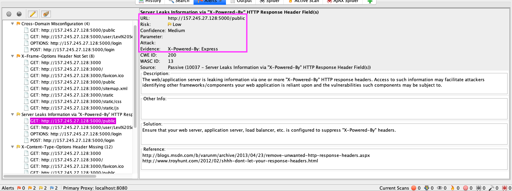  
**Figure 36:** The result of running the OWASP ZAP tool on the URL for our web application.

From the above we see that that it reports multiple vulnerabilities. We have chosen to focus on one: "Server Leaks Information via `X-Powered-By'` HTTP Response Header Field(s)".

##### Fixing The Vulnerability

In order to fix the vulnerability, we used a tool called [`helmet`](https://helmetjs.github.io/) which prevents some of Express' security issues (Express is the popular framework we use to create our server). OWASP ZAP reported that our HTTP responses exposed which framework we are powered by (see the pink rectangle) which could be valuable information for attackers. We fixed these issues by implementing `helmet` in our server which prevents this information from being sent with our HTTP responses. This mitigates risk number 2.

### Observations by Monitoring Group

As pointed out by the [group monitoring us](https://github.com/mortenskoett/itu-devops-group-noname/blob/master/Session_09_Security_Report.pdf), it is possible for hackers to go to an open port in our system and read data collected by Prometheus. This would be a huge issue if this was a real product, but it could easily be fixed by whitelisting specific IPs that should have access to specific ports. Furthermore, they also pointed out that we have credentials for Grafana written directly in the source code. This could also easily be fixed, but the course required us to have exactly those credentials, so we did not act on this vulnerability.

### Overall Assessment

Overall this system is not bulletproof and has several security vulnerabilities. Vulnerabilities related to header information in HTTP requests and things like click-jacking found by OWASP ZAP are minor issues and can be considered negligible. On the other hand, we also have a few credentials in the source code and open ports for everyone to listen to. These are critical but should be prevented/fixed fairly easily. External factors like stability of DigitalOcean cannot be considered preventable, because we can't do anything to mitigate the risk for DigitalOcean going down. The only option we would have would be to change to another cloud provider, which luckily should be easy enough due to the facts that everything is containerized and that much of the configuration can be transferred to other providers, e.g. the Docker Compose and Docker Swarm setups.